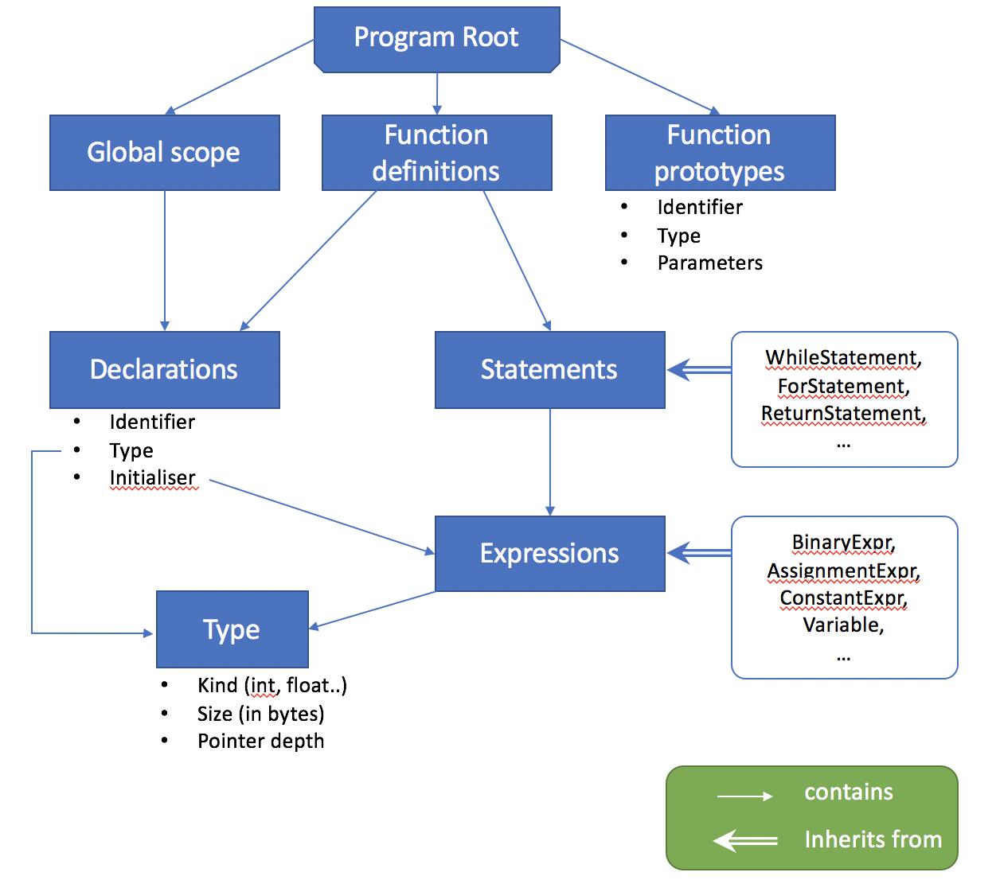

Documentation
=============

AST
===

Overview Diagram
----------------



Description
-----------

The AST for this compiler is mostly object-oriented. Every part of the tree inherits from a base "Node" class, with virtual functions taking advantage of C++ polymorphism. A project of this scale greatly benefited from compile-time checks to make sure that functions such as PrintAST and GenerateMIPS were overridden in all of the derived classes.

At the top level of the AST, a program is divided into variables and functions. Each function is an isolated piece of code that gets compiled independently from everything else.

The rest of the AST is divided into either expressions or statements. Expressions are always associated with a type (e.g. `int` or `float *`), and when generating assembly, evaluate into a result. For example, `(char+char)` is associated with type `int`, performs addition on its two children and stores the output in a specific destination, that can be used by its parent node. Statements, although they can sometimes be nested, do not evaluate into a result and do not have a type. This includes things like loops or return statements.

To cut down on code, expressions with similar semantics are grouped into a single class, e.g. `&`, `|`, `^` are all part of BinaryExpression.


Strengths
---------

### Strength 1

The AST is split into many classes, which keeps individual files a manageable length and compartmentalizes a lot of code. The functionality of a specific node can be understood easily from one file without being overloaded with information.

### Strength 2

The structure of the AST is oriented towards the semantics of code rather than the format of input C source. This makes code generation much simpler as every AST node always generates one specific sequence of MIPS code, regardless of its context.

Limitations
-----------

### Limitation 1

Because the AST is built around a working knowledge of C, rather than the C specification, certain obscure aspects of the C standard were too difficult to implement around the AST that I had built, and had to be left out (e.g. function pointers).

### Limitation 2

As I was still learning object-oriented programming when I started the AST, the earlier code has some bad practices such as heavy use of dynamic casting to walk up and down the object hierarchy. This does not seem to affect functionality at present but could lead to maintainability issues.


Variable binding
================

General approach
----------------

The conversion from AST to assembly was split with an additional Intermediate Representation step, an in-house strongly typed pseudo-assembly. This step gets rid of nesting but does not yet take care of type casting or architecture-specific details.

Therefore, variable binding happens in two stages. First, nesting and shadowing is resolved at the `AST->IR` stage, by maintaining a dictionary of variable names to their nesting-free aliases. At the same time, the stack requirements are calculated by making a list of all of the variables in a function and their types.

At the `IR->MIPS` stage, each variable in the stack is assigned a stack offset, that is passed on to the IR instructions along with type information so that they can generate MIPS assembly and the appropriate type conversions.

Each IR instruction reads its operands from memory (stack for local variables, labels for globals). It then performs its calculations in registers. This includes converting between types (e.g. for integral promotion) and can use up to 10 registers at once! At the end of each operation, the results are written back to memory.

Strengths
---------

### Strength 1

Memory allocation on the stack is very well defined, with little attempt at optimisation. This means that the compiler has very few bugs, which was the leading objective of the design.

### Strength 2

Thanks to strongly typed bindings, variables are not limited to 4-byte integers, so the compiler can support any level of nested structs, unions, and double precision floating-point.

Limitations
-----------

### Limitation 1

Registers are not used to their full potential, and the compiled programs have a heavy memory usage due to everything being stored on the stack. However, the fact of having an IR also means this can be easily improved with some use-def analysis.

### Limitation 2

To make sure that type casting is handled correctly, all variables go through a type conversion in every single operation, even if the source and destination types are the same. A better compiler would recognise their type equality from the bindings and optimise away the redundant conversion.

Reflection
==========

Strengths
---------

### Strength 1

Using an IR allowed me to manage the complexity of a compiler into smaller parts. The benefits this decision had in debugging were incredible: understanding IR is much easier than understanding assembly, so I could make sure the `AST->IR` stage worked for any given instruction before tackling the `IR->MIPS` part.

### Strength 2

Another strength of the compiler is that many complicated C constructs such as for loops and if/else statements boiled down to just a handful of IR instructions. This meant I only had to write the MIPS assembly for "jump if equal to zero" once, instead of once per C construct.

Scope for Improvement
---------------------

### Improvement 1

If the grammar and AST followed the C specification more closely, it would be possible to support more complicated declarations and types, such as const-qualified variables and pointers to functions.

### Improvement 2

I would like to optimise the generated code to make better use of registers. This could be done by storing a rolling index of available registers, and only accessing memory when these run out. Managing branches would present a difficulty and possibility for bugs.


Functionality (not assessed)
============================

Which of these features does your compiler support (insert
an `x` to check a box):

```
1 - [x] Local variables
2 - [x Integer arithmetic
3 - [x] While
4 - [x] IfElse
5 - [x] For
6 - [x] Function calls
7 - [x] Arrays
8 - [x] Pointers
9 - [x] Strings
10 - [x] Structures
11 - [x] Floating-point
```

Note that all features will be tested, regardless of what
appears here. This is documentation of what you expect to work,
versus what doesn't work.


Feedback (not assessed)
=======================

### Feedback 1

Could the Intermediate Representation be improved by making it more high-level or more low-level?

### Feedback 2

What structural changes would be required if I were to use this code-base as a starting point for implementing optimisations?
